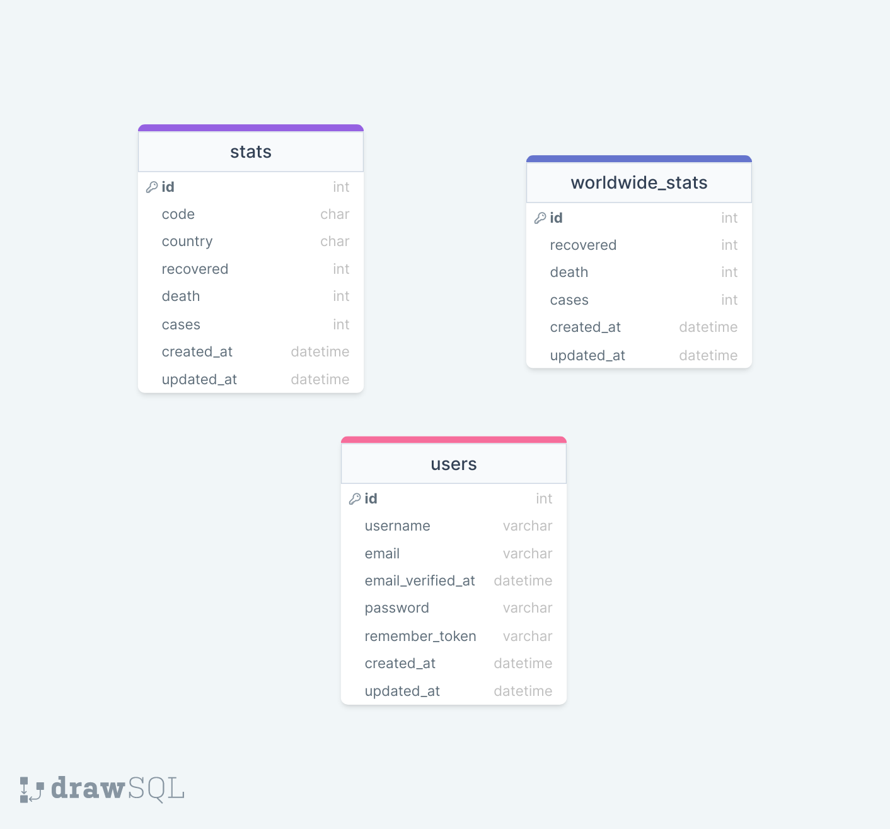

<div style="display:flex; align-items: center">
  <h1 style="position:relative; top: -6px" >Coronatime</h1>
</div>

---
Coronatime provides information about current Covid Statistics both by country and around the world. Data is updated daily. Content is available in English and Georgian languages. Seeing the data requires email verification and authoritation.

Page link: http://coronatime.giorgi-tseradze.redberryinternship.ge/

#
### Table of Contents
* [Prerequisites](#prerequisites)
* [Tech Stack](#tech-stack)
* [Getting Started](#getting-started)
* [Migrations](#migration)
* [Development](#development)
* [SQL tables](#SQL-tables)

#
### Prerequisites

* *PHP 8.1.9*
* *MYSQL@8.0.30*
* *npm@6.14.17*
* *composer@2.4.1*


#
### Tech Stack

* [Laravel@9.19](https://laravel.com/docs/9.x) - back-end framework
* [Spatie Translatable](https://github.com/spatie/laravel-translatable) - package for translation

#
### Getting Started
1\. First of all you need to clone repository from github:
```sh
git clone https://github.com/RedberryInternship/giorgi-tseradze-coronatime.git
```

2\. Next step requires you to run *composer install* in order to install all the dependencies.
```sh
composer install
```

3\. after you have installed all the PHP dependencies, it's time to install all the JS dependencies:
```sh
npm install
```

and also:
```sh
npm run dev
```
in order to build your JS/SaaS resources.

4\. Now we need to set our env file. Go to the root of your project and execute this command.
```sh
cp .env.example .env
```
And now you should provide **.env** file all the necessary environment variables:

#
**MYSQL:**
>DB_CONNECTION=mysql

>DB_HOST=127.0.0.1

>DB_PORT=3306

>DB_DATABASE=*****

>DB_USERNAME=*****

>DB_PASSWORD=*****


##### Now, you should be good to go!


#
### Migration
if you've completed getting started section, then migrating database if fairly simple process, just execute:
```sh
php artisan migrate
```

#
### Running Unit tests
Running unit tests also is very simple process, just type in following command:

```sh
composer test
```

#
### Development

You can run Laravel's built-in development server by executing:

```sh
  php artisan serve
```

when working on JS you may run:

```sh
  npm run dev
```
it builds your js files into executable scripts.
If you want to watch files during development, execute instead:

```sh
  npm run watch
```
it will watch JS files and on change it'll rebuild them, so you don't have to manually build them.


#
### SQL Tables
 